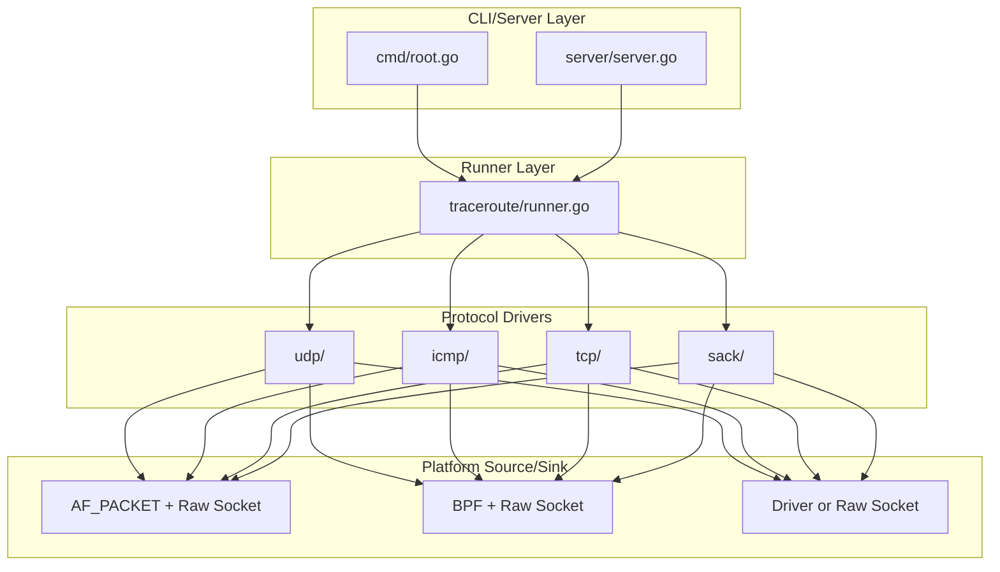

# IPv6 Traceroute Support Implementation Plan

## Overview

Add comprehensive IPv6 support to datadog-traceroute for all protocol variants (UDP, ICMP, TCP SYN, TCP SACK) across all platforms (macOS, Linux, Windows), following the step-by-step approach requested.

**Platform Order:** macOS → Linux → Windows

## Current State Analysis

The codebase already has partial IPv6 infrastructure:
- `WantV6` parameter in `traceroute/params.go`
- DNS resolution with IPv6 preference in `traceroute/runner.go`
- `FrameParser` handles both IPv4/IPv6 in `packets/frame_parser.go`
- ICMP driver has IPv6 packet generation in `icmp/icmp_packet.go`
- UDP packet generation supports IPv6 in `udp/udpv4.go`
- Linux/Darwin sinks already handle IPv6 addresses

## Architecture Approach



---

## Step 1: UDP IPv6 on macOS

**Challenge:** macOS doesn't support `IPV6_HDRINCL` for raw sockets. ICMPv6 requires `SOCK_DGRAM` per RFC 3542.

**Files to verify/modify:**
- `packets/packet_sink_darwin.go` - Already handles IPv6 via `stripIPv6Header`
- `packets/bpfdev_darwin.go` - Verify IPv6 packet capture
- `udp/udpv4.go` - Already has IPv6 packet creation

**Key changes:**
1. Darwin sink already handles IPv6 by stripping header and setting `IPV6_HOPLIMIT` via socket option
2. Verify BPF device captures IPv6 traffic correctly (DLT_EN10MB should work)
3. Verify UDP IPv6 packet generation works on macOS

**Testing:**
- Manual: `./datadog-traceroute --e2e-queries 5 --proto udp --ipv6 ::1`
- Manual: `./datadog-traceroute --e2e-queries 5 --proto udp --ipv6 ipv6.google.com`

---

## Step 2: ICMP IPv6 on macOS

**Files to verify/modify:**
- `icmp/icmp_driver.go` - Already handles ICMPv6
- `icmp/icmp_packet.go` - Already has `generatePacketV6`
- `packets/packet_sink_darwin.go` - Verify ICMPv6 socket

**Key changes:**
1. Ensure `icmpDriver.handleProbeLayers()` ICMPv6 path works on macOS
2. ICMPv6 uses protocol number 58 (`IPPROTO_ICMPV6`) vs ICMPv4's 1
3. For ICMPv6, may need special handling if raw socket fails

**Testing:**
- Manual: `./datadog-traceroute --e2e-queries 5 --proto icmp --ipv6 ::1`
- Manual: `./datadog-traceroute --e2e-queries 5 --proto icmp --ipv6 ipv6.google.com`

---

## Step 3: TCP SYN IPv6 on macOS

**Files to modify:**
- `tcp/tcpv4.go` - Add IPv6 packet creation method
- `tcp/tcp_driver.go` - Add ICMPv6 handling in `handleProbeLayers`
- `packets/tcp_filter.go` - Add `GenerateTCP6Filter`
- `packets/cbpf_filters.go` - Add IPv6 TCP filter selection

**Key changes:**
1. Add `createRawTCPSynBufferV6` method for IPv6 TCP SYN packets:

```go
func (t *TCPv4) createRawTCPSynBufferV6(packetID uint16, seqNum uint32, ttl int) ([]byte, error) {
    ipLayer := &layers.IPv6{
        Version:    6,
        HopLimit:   uint8(ttl),
        NextHeader: layers.IPProtocolTCP,
        SrcIP:      t.srcIP,
        DstIP:      t.Target,
    }
    // ... TCP layer setup with checksum
}
```

2. Add `GenerateTCP6Filter` for BPF filtering with IPv6 addresses
3. tcpDriver must handle `layers.LayerTypeICMPv6` with `ICMPv6TypeTimeExceeded`
4. Update filter selection logic based on IP version

**Testing:**
- Unit test IPv6 TCP SYN packet generation
- Manual: `./datadog-traceroute --e2e-queries 5 --proto tcp --tcp-method syn --ipv6 ipv6.google.com:443`

---

## Step 4: TCP SACK IPv6 on macOS

**Files to modify:**
- `sack/traceroute_sack.go` - Remove IPv6 restriction in `validate()`
- `sack/sack_packet.go` - Add `generatePacketV6` method
- `sack/sack_driver.go` - Add ICMPv6 handling
- `packets/cbpf_filters.go` - Add IPv6 SYNACK filter

**Key changes:**
1. Remove the IPv6 block in `sack.Params.validate()`:

```go
// Remove this check:
if addr.Is6() {
    return fmt.Errorf("SACK traceroute does not support IPv6")
}
```

2. Add `generatePacketV6` in sack_packet.go for IPv6 TCP packets
3. Update `sackDriver.handleProbeLayers()` to handle `LayerTypeICMPv6`
4. Add IPv6 SYNACK BPF filter

**Testing:**
- Manual: `./datadog-traceroute --e2e-queries 5 --proto tcp --tcp-method sack --ipv6 ipv6.google.com:443`

---

## Step 5: Complete IPv6 for Linux (All Protocols)

### Step 5a: UDP IPv6 on Linux - COMPLETED

**Status:** DONE

**Verification findings:**
- `udp/udpv4.go`: `createRawUDPBuffer` already supports IPv6 packet creation (lines 112-131)
- `udp/udp_driver.go`: `handleProbeLayers` already handles both `LayerTypeICMPv4` and `LayerTypeICMPv6` (line 142)
- `packets/cbpf_filters.go`: `icmpFilter` generated from `'icmp || icmp6'` - already supports ICMPv6
- `packets/frame_parser.go`: `GetICMPInfo` handles both ICMPv4 and ICMPv6 wrapped packets

**Tests verified:**
- `TestUDPDriverTwoHopsIPV6` - comprehensive IPv6 driver flow test (already existed)
- `TestCreateRawUDPBufferIPv6` - IPv6 packet generation test (added)
- `TestCreateRawUDPBufferIPv6DifferentTTLs` - TTL variation test (added)

### Step 5b: ICMP IPv6 on Linux

**Files to modify:**
- `icmp/icmp_driver.go` - Already handles ICMPv6
- `icmp/icmp_packet.go` - Already has `generatePacketV6`
- `packets/packet_sink_linux.go` - Verify ICMPv6 socket

**Key changes:**
1. Linux raw socket with `IPPROTO_RAW` works for IPv6 (verified in existing code)
2. Ensure `icmpDriver.handleProbeLayers()` ICMPv6 path is fully tested
3. ICMPv6 uses protocol number 58 (`IPPROTO_ICMPV6`) vs ICMPv4's 1

**Testing:**
- Manual: `./datadog-traceroute --e2e-queries 5 --proto icmp --ipv6 ::1`
- Manual: `./datadog-traceroute --e2e-queries 5 --proto icmp --ipv6 ipv6.google.com`

### Step 5c: TCP SYN IPv6 on Linux

Same changes as Step 3 (macOS), applied to Linux.

### Step 5d: TCP SACK IPv6 on Linux

Same changes as Step 4 (macOS), applied to Linux.

---

## Step 6: IPv6 for Windows (All Protocols)

**Challenge:** Windows raw sockets (`SOCK_RAW`) don't support `IPV6_HDRINCL`. Per Microsoft docs, IPv6 raw sockets receive data after the IPv6 header, and cannot send packets with custom IPv6 headers.

**Files to modify:**
- `packets/rawconn_windows.go` - Add IPv6 support using separate approach
- `packets/sourcesink_windows.go` - Route IPv6 to appropriate implementation
- `winconn/winconn_windows.go` - Verify ICMPv6 socket support

**Solution approach:**
1. For IPv6 on Windows, use the **driver-based approach** (already captures ICMPv6)
2. For sending IPv6 packets, create protocol-specific sockets:
   - ICMPv6: Use `SOCK_DGRAM` with `IPPROTO_ICMPV6`
   - TCP/UDP: The driver can inject packets with custom headers

3. Update `NewRawConn` to return error with guidance for IPv6:

```go
case addr.Is6():
    return nil, fmt.Errorf("NewRawConn: IPv6 requires driver mode (--windows-driver)")
```

4. Add IPv6 support to driver-based sink for TCP/UDP injection

**Testing:**
- Manual tests on Windows with `--windows-driver` flag for IPv6
- Document that IPv6 on Windows requires driver mode

---

## Cross-Platform Changes

### E2E Tests

**Note:** E2E tests for IPv6 are not supported yet. GitHub Actions runners do not have IPv6 networking enabled, making automated IPv6 testing infeasible in CI. IPv6 functionality must be validated through manual testing until GitHub Actions adds IPv6 support.

---

## Unit Test Coverage

New test files/additions needed:
- `udp/udpv6_test.go` - IPv6 UDP packet generation
- `tcp/tcpv6_test.go` - IPv6 TCP SYN packet generation  
- `sack/sackv6_test.go` - IPv6 SACK packet generation
- `packets/tcp_filter_test.go` - Add IPv6 filter tests
- `packets/frame_parser_test.go` - Add IPv6 parsing tests

---

## Risk Assessment

| Platform | Protocol | Risk Level | Notes |
|----------|----------|------------|-------|
| macOS | UDP | Low | Infrastructure exists, verify BPF capture |
| macOS | ICMP | Medium | May need ICMPv6 socket workaround |
| macOS | TCP SYN | Medium | Needs new packet generation |
| macOS | TCP SACK | Medium | Needs new packet generation + filter |
| Linux | UDP | Low | Already completed |
| Linux | ICMP | Low | Code exists, needs testing |
| Linux | TCP SYN | Low | Reuse macOS implementation |
| Linux | TCP SACK | Low | Reuse macOS implementation |
| Windows | All | High | Requires driver mode, no raw IPv6 |

---

## Execution Order

Execute in strict sequence as specified, validating each step before proceeding:

**Platform Order: macOS → Linux → Windows**

1. **Step 1 (UDP/macOS)**: Verify UDP IPv6 works on macOS
2. **Step 2 (ICMP/macOS)**: Verify ICMPv6 handling on macOS
3. **Step 3 (TCP SYN/macOS)**: Add TCP IPv6 packet generation (shared with Linux)
4. **Step 4 (TCP SACK/macOS)**: Complete macOS IPv6 support
5. **Step 5 (Linux)**: Complete all protocols on Linux (UDP already done)
6. **Step 6 (Windows)**: Platform-specific challenges with driver mode

After each step: run CLI manually, add unit tests, add e2e tests, verify CI passes.

---

## Implementation Todos

### macOS (First)
- [x] **step1-udp-macos**: IPv6 UDP support on macOS: verify packet generation, test end-to-end
- [ ] **step2-icmp-macos**: IPv6 ICMP support on macOS: verify ICMPv6 handling, test end-to-end
- [ ] **step3-tcp-syn-macos**: IPv6 TCP SYN on macOS: add IPv6 packet generation, BPF filter
- [ ] **step4-tcp-sack-macos**: IPv6 TCP SACK on macOS: remove restriction, add IPv6 packet gen

### Linux (Second)
- [ ] **step5a-udp-linux**: IPv6 UDP support on Linux: verify/fix packet generation, test end-to-end
- [ ] **step5b-icmp-linux**: IPv6 ICMP support on Linux: verify ICMPv6 handling, test end-to-end
- [ ] **step5c-tcp-syn-linux**: IPv6 TCP SYN on Linux: verify TCP IPv6 works after macOS impl
- [ ] **step5d-tcp-sack-linux**: IPv6 TCP SACK on Linux: verify SACK IPv6 works after macOS impl

### Windows (Third)
- [ ] **step6-windows-ipv6**: IPv6 support on Windows: driver-based approach for all protocols

### Cross-Platform
- [ ] **e2e-tests**: E2E tests for IPv6 not supported (GitHub Actions runners lack IPv6 networking)

